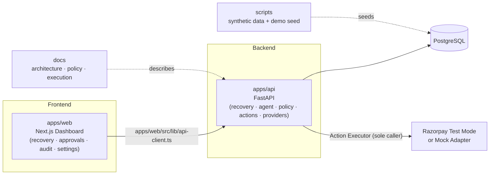
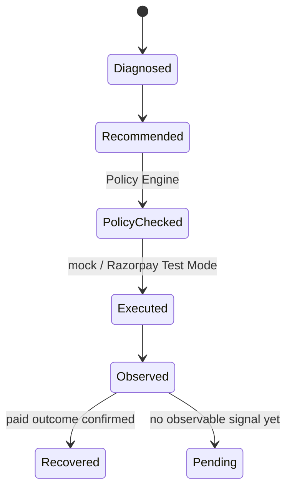

<div align="center">

# 💳 R.AI

### Autonomous Revenue Recovery Agent for Razorpay

**Merchant revenue intelligence and recovery — policy-bounded, deterministic, and fully auditable.**

[](#)
[](#)
[](#)

<br/>

<sub>🔒 The LLM never executes payment-provider operations. The Policy Engine is deterministic application code.</sub>

</div>

<br/>

<div align="center">

### 🛠️ Tech Stack

**Frontend**
<br/>


**Backend**
<br/>


**Data & Infra**
<br/>


**Payments**
<br/>


</div>

---

## 📚 Table of Contents

- [Overview](#-overview)
- [Tech Stack](#️-tech-stack)
- [Architecture](#-architecture)
- [Recovery Lifecycle](#-recovery-lifecycle)
- [Quick Start](#-quick-start)
- [Synthetic Data](#-synthetic-data)
- [API Reference](#-api-reference)
- [Testing](#-testing)
- [Demo Flow](#-demo-flow)
- [Configuration](#-configuration)
- [Docs](#-docs)

---

## 🔎 Overview

**R.AI** diagnoses at-risk merchant revenue (failed payments, churn-prone subscriptions), recommends a recovery action, checks that action against a deterministic policy engine, and — only within tightly scoped, low-risk cases — executes it autonomously. Every step is observed, evaluated against a baseline, and recorded in an append-only audit trail.

> Sprint 5 adds outcome observation, evaluation analytics, and a deterministic mock demo on top of policy-bounded execution.

<table>
<tr>
<td width="50%">

**🧠 What the AI does**
Diagnoses cases and proposes a recovery action.

</td>
<td width="50%">

**⚖️ What the Policy Engine does**
Deterministically approves, blocks, or routes for approval — no LLM calls involved.

</td>
</tr>
</table>

---

## 🏗️ Architecture



<details>
<summary><b>📁 Repo layout</b></summary>

| Path | Purpose |
|---|---|
| `apps/web` | Next.js dashboard — recovery, approvals, audit, settings |
| `apps/api` | FastAPI service — recovery, agent, policy, actions, providers |
| `docs` | Architecture, policy engine, and payment execution docs |
| `scripts` | Synthetic data generation and demo seeding |

The frontend talks to the backend **only** through `apps/web/src/lib/api-client.ts`.

</details>

---

## 🔄 Recovery Lifecycle



- Execution success **is not** recovery — a case is marked `Recovered` only after an **observed paid outcome**.
- **Payment Link** recovery is observed via the provider abstraction.
- **Subscription** recovery is provider-managed / deferred, recorded as *pending observation* when no documented collection operation exists.
- All provider calls go through the mock or Razorpay Test Mode adapters — the **Action Executor is the sole caller**.
- Idempotency fingerprints + append-only audit records protect against repeated requests and preserve the full decision trail.

---

## 🚀 Quick Start

<details open>
<summary><b>1. Run database migrations</b></summary>

```bash
cd apps/api
alembic upgrade head
```

In Docker:

```bash
docker compose run --rm api alembic upgrade head
```

</details>

<details>
<summary><b>2. Generate synthetic data + seed the demo</b></summary>

All generated customers are fake (`@example.invalid`), generated with a fixed seed.

```bash
python scripts/generate_data.py --seed 42 --customers 1000 --payments 10000
python scripts/seed_demo.py
```

In Docker, after migrations:

```bash
docker compose exec api python -m app.data.seed
```

The demo seed enables tightly scoped autonomous execution so low-value Payment Link recovery can be demonstrated in mock mode.

</details>

<details>
<summary><b>3. Start the app and run the demo</b></summary>

1. Start PostgreSQL and the API, run migrations, and seed the demo dataset.
2. Start the web app and open **Analytics**.
3. Select **Run Recovery Demo**.
4. Follow the case through diagnosis → recommendation → deterministic policy validation → mock Payment Link execution → simulated observation → paid outcome.

> Uses fake data and the mock provider only. It never creates a real charge or notification.

</details>

---

## 🧪 Synthetic Data

All generated customers use `@example.invalid` addresses. Generation is deterministic via a fixed seed — see [Quick Start](#-quick-start) above for commands.

---

## 🔌 API Reference

<details open>
<summary><b>Sprint 5 additions</b></summary>

| Method | Endpoint | Notes |
|---|---|---|
| `GET` | `/api/v1/analytics/overview\|recovery\|evaluation\|actions\|outcomes` | Analytics surfaces |
| `POST` | `/api/v1/demo/recovery` | Mock-only — no real charges or notifications |
| `GET` | `/api/v1/outcomes/cases/{id}` | Case outcome |
| `POST` | `/api/v1/outcomes/cases/{id}/observe` | Record an observation |

Evaluation compares baseline vs. R.AI recommendations on the same stored cases using a deterministic synthetic recoverability model. Recovery rates, agreement, block/approval rates, and lift are **synthetic evaluation metrics, not live financial performance**. Observed paid outcomes are labeled separately as database outcomes.

</details>

<details>
<summary><b>Sprint 4 additions</b></summary>

| Method | Endpoint |
|---|---|
| `GET` / `PUT` | `/api/v1/policies` |
| `GET` | `/api/v1/policies/evaluate/{case_id}` |
| `POST` | `/api/v1/recovery/cases/{case_id}/execute` |
| `GET` | `/api/v1/actions`, `/api/v1/actions/{id}`, `/api/v1/actions/summary` |
| `GET` / `POST` | `/api/v1/approvals`, `/api/v1/approvals/approve`, `/api/v1/approvals/reject` |
| `GET` | `/api/v1/audit` |

Existing health, payments, recovery, and agent endpoints remain.

</details>

---

## ✅ Testing

```bash
cd apps/api
pytest
```

```bash
cd apps/web
npm run lint
npm run typecheck
```

Automated tests use `PAYMENT_PROVIDER=mock` and do not require Razorpay credentials.

---

## ⚙️ Configuration

Default `.env.example`:

```env
AI_MODE=mock
PAYMENT_PROVIDER=mock
```

To attempt Razorpay Test Mode (optional):

```env
PAYMENT_PROVIDER=razorpay
RAZORPAY_KEY_ID=rzp_test_...
RAZORPAY_KEY_SECRET=...
```

> ⚠️ **Never commit secrets to source control. Live keys are rejected.**

---

## 📖 Docs

| Topic | File |
|---|---|
| Scoring | [`docs/recovery-intelligence.md`](docs/recovery-intelligence.md) |
| Policy engine | [`docs/policy-engine.md`](docs/policy-engine.md) |
| Payment execution | [`docs/payment-execution.md`](docs/payment-execution.md) |
| Agent handoff | [`docs/PROJECT_CONTEXT.md`](docs/PROJECT_CONTEXT.md) |

---

<div align="center">
<sub>Built for Razorpay · Mock-first by design · Every decision is auditable</sub>
</div>
